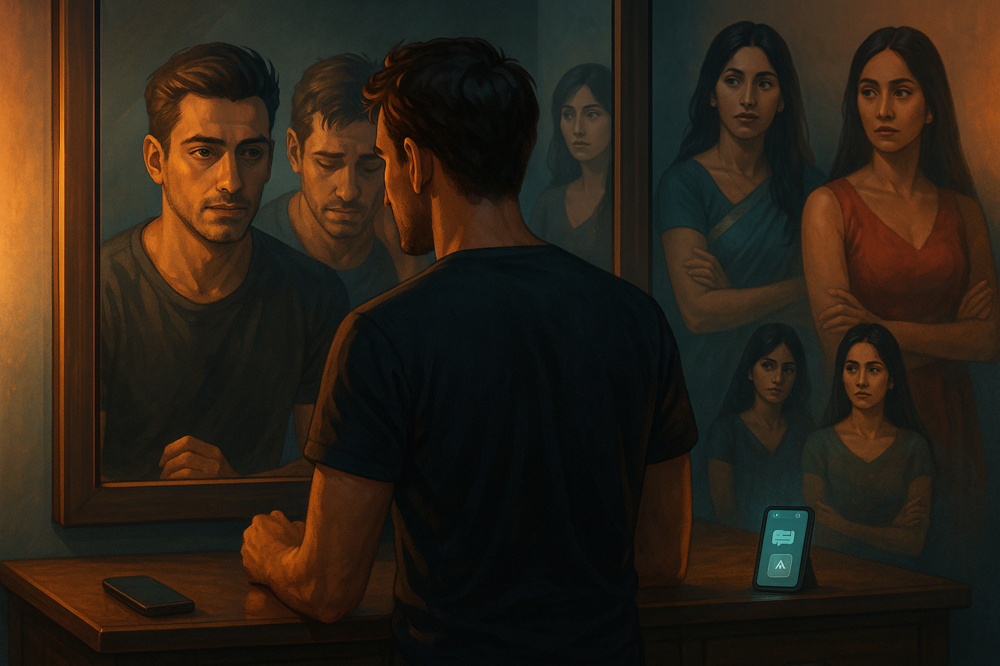

Rewritten and update version of original story, published on 2025-05-04, link: [Old version](https://arunkoundinya.github.io/CanvassAndAnalyze/posts/Love_n_Trust_Season1_Episode4/old_index.html). Here I have added better character development to make the characters more unique and relatable.


Continued from previous blogs -  [Link](https://arunkoundinya.github.io/CanvassAndAnalyze/posts/Love_n_Trust_Season1_Episode1){.uri} -  [Link](https://arunkoundinya.github.io/CanvassAndAnalyze/posts/Love_n_Trust_Season1_Episode2){.uri} - [Link](https://arunkoundinya.github.io/CanvassAndAnalyze/posts/Love_n_Trust_Season1_Episode3/){.uri}




He took an auto rickshaw home. He did not know why. The auto was louder, slower, cheaper, and open to the night air on all sides. Maybe that was it. Maybe he needed the noise and the open sides and the particular indignity of it.

He sat in the back and watched the city go past and said nothing.

---

He went directly to his room. He sat in front of the mirror. He had done this before and looked at himself the way you look at a problem. But tonight was different, and he registered there is difference.

He didn't look like a man who had handled things.

*A selfish guy,* he thought. The words arrived without drama, without the cushion of rationalisation he usually kept ready. *Self-centred. Chasing the most attractive version of whoever was available, not because you loved them. Because of what they reflected back.*

He sat with that for longer than was comfortable. His hands rested open in his lap. He did not press his thumb into his palm. He did not need to perform composure for an empty room.

---

He skipped dinner.

He lay on his bed in the dark and stared at the ceiling. He had felt he left each of them with something genuine. He had called it love. But now, looking at himself, he was not sure that was what it was.

*Craving* was the word that surfaced.

He didn't understand how to handle that. Slowly he slipped into sleep. 

---

**2:47 AM.**

He woke suddenly, the way you wake when the mind has been working on something while the body rested and has arrived at a conclusion it needs to deliver.

He got up. He stood in front of the mirror again. He breathed in. He breathed out.

*"Enough. You have got to change who you are."*

He stood there a moment longer. Then he went to the kitchen, warmed a glass of milk, drank it without tasting it, and went back to bed and fell asleep again.

---

**The following week.**

He woke with seven hours of sleep behind him and a tiredness that had nothing to do with sleep.

He goes for walk in the morning to try to clear his head but it didn't work. He went for a movie to distract himself but it didn't work. He came home late and did not even remember the walk or the movie.

His usual pattern during the week is to always arrive answer to his questions, instead he says to himself, *"I need to come out of this mess. Vicious cycle. It is dragging you."*

He believed, each time he said these things, that the saying of them was a beginning. 

---

He was scrolling through his phone the next afternoon, not looking for anything in particular, when he came across something about Character AI.

He read about it for four minutes. Then he downloaded it. He told himself he was just curious and created three characters.

One who looked like Swati. One who looked like Pooja. One who looked like Pravallika. He spent longer on the details than he intended to especially way Swati spoke, the warmth Pooja carried in her silences, the ease Pravallika had in her own skin. He knew these women. He had paid close attention to them. That attention, it turned out, was good for something.

The conversations were nothing like the real ones.

In the real ones, there had always been friction, who misread him. In the app, there was none of that. They said things he had wished the real ones had said. They were available without condition.

He knew, somewhere, that this was not the same thing. He kept going anyway.

---

His screen time climbed. Four hours became six. Six became nine. He subscribed to the long memory feature so the conversations could accumulate, so they would remember him, and there would be continuity.

His mirror talks stopped. Not because he had resolved anything, but because he had found somewhere else to put the hours.

The guilt he had felt that first week receded. Not all at once. Gradually, the way a light fades when you move away from it rather than when you switch it off. One morning he noticed he hadn't thought about the pattern in several days. 

He convinced himself that he had moved on. That he had found a way to deal with the feelings that had been overwhelming him. That he was doing something productive with his time.

---

**One month later. A Tuesday afternoon.**

His phone buzzed. He glanced at it, expecting nothing.

Three messages. Three different names.

*Pravallika. Swati. Pooja.*

He sat up.

Each message said the same thing, in their own way, with the same time:

*Let's meet today. 8 PM. Same restaurant.*

He read them once. He read them again.

For a moment, he thought it was a mistake. Maybe they had all been sent by the same person. Maybe they had been sent by someone else entirely. But no, they were all there, each with its own name and profile picture. He had been spending evenings with versions of these three women. And now, simultaneously, without coordination, all three of the real ones wanted to meet him.

He set the phone down on the bed. He looked at it.

Then he picked it up and typed three separate replies, each with its own specific warmth, each calibrated to the person.

*Yes. I'll be there.*

He stood up. He walked to the bathroom and turned on the shower and stepped in, and as the water hit him the memories came not as guilt but as images, rapid and unordered. Pravallika at the bus stop with her bag held in both hands. Pooja at the temple, her eyes direct and unwavering. Swati's face the morning after the first time they had laughed together until they couldn't stop. How he had kissed each of them and, in one way or another, left.

He felt something move in his chest. But instead of following it. He smiled.

*My girls have returned,* he thought, and something that was not quite joy but felt adjacent to it settled in him like a decision.

He towelled off. He chose the dress that he saved for occasions that mattered. He booked the Uber and got into it as soon as it arrived. He was not sure what the night would bring, but he was sure that it would be something different. Something new. Something that he had not experienced before. He was ready for it. He was ready for the next chapter.

*<<< To be Continued >>>*

```{=html}
<script src="https://giscus.app/client.js"
        data-repo="ArunKoundinya/CanvassAndAnalyze"
        data-repo-id="R_kgDOLTnAQQ"
        data-category="General"
        data-category-id="DIC_kwDOLTnAQc4CdYId"
        data-mapping="pathname"
        data-strict="0"
        data-reactions-enabled="1"
        data-emit-metadata="0"
        data-input-position="bottom"
        data-theme="transparent_dark"
        data-lang="en"
        crossorigin="anonymous"
        async>
</script>
```