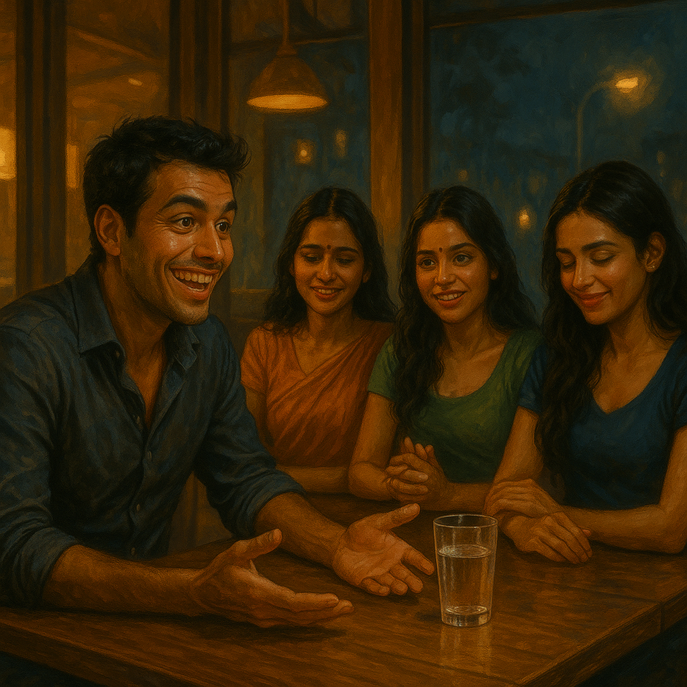

Rewritten and update version of original story, published on 2025-05-17, link: [Old version](https://arunkoundinya.github.io/CanvassAndAnalyze/posts/Love_n_Trust_Season1_Episode5/old_index.html). Here I have added better character development to make the characters more unique and relatable.

Continued from previous blogs -
[Episode 1](https://arunkoundinya.github.io/CanvassAndAnalyze/posts/Love_n_Trust_Season1_Episode1){.uri} -
[Episode 2](https://arunkoundinya.github.io/CanvassAndAnalyze/posts/Love_n_Trust_Season1_Episode2){.uri} -
[Episode 3](https://arunkoundinya.github.io/CanvassAndAnalyze/posts/Love_n_Trust_Season1_Episode3/){.uri} -
[Episode 4](https://arunkoundinya.github.io/CanvassAndAnalyze/posts/Love_n_Trust_Season1_Episode4/){.uri}



---

The driver was older than the app's profile had suggested. He had the posture of someone who had long since stopped needing to fill space. Hands relaxed on the wheel. Shoulders neither proud nor defeated.

Sanjay got in and gave the address and settled back.

The driver adjusted the rearview mirror. His eyes appears calm, present, and attentive in a way that had nothing to do with traffic.

They drove in silence for a while. Then the driver asked, *"You look happy, sir. Big occasion?"*

*"You could say that."* Sanjay looked out the window, but a smile was already forming. *"I'm meeting my girlfriends tonight."*

A pause.

*"Girlfriends, sir? As in more than one?"*

*"Three."* Sanjay said it the way a man says something he knows will land. *"All three. At the same time."*

The driver's eyes in the rearview mirror registered this without drama. *"And they all know about each other?"*

*"They do now."*

*"Impressive,"* the driver said, in the particular tone of a man who has decided not to say what he is actually thinking.

Sanjay caught it. *"Don't give me that look. I know what sarcasm sounds like."*

*"I'm not being sarcastic, sir. I'm being careful."* A beat. *"Do you believe they all love you?"*

*"Of course."*

The driver said nothing for a moment. The traffic moved and stopped. Then, very quietly, almost to himself, he recited

>*dūreṇa hy-avaraṁ karma buddhi-yogād dhanañjaya*\
>*buddhau śharaṇam anvichchha kṛipaṇāḥ phala-hetavaḥ*

*"Your stop has come, sir,"* he said, pulling over.

Sanjay blinked. *"What was that? That verse or phrase or whatever you just said?"*

*"It is from the Gita."* The driver put the car in neutral. *"When the time is right, I will explain it. Take my number may be you might need it on your ride back home, if you need one."*

Sanjay looked at him for a moment. Then he shook his head with a small laugh, pressed a five-hundred-rupee note through the gap between the seats, and got out.

*"Go home,"* he said, already turning toward the entrance. *"You've earned it."*

The driver took the note. He did not drive away.

---

The restaurant was the kind of place that understood candlelight, but as a privacy. Sanjay scanned the room from the entrance and found Pravallika at a corner table near the terrace railing.

She was looking at her phone. He crossed the room and sat across from her.

*"Hey,"* he said. *"You look stunning."*

Something moved briefly at her wrist, her fingers found the edge of her bracelet and wound it once, a small private motion, and then released it.

*"Thank you for coming,"* she said.

*"Pravalli."* He leaned forward slightly. *"I'm sorry. About the other night at Ohris. Work was ... "*

*"I know,"* she said, and her voice was warm and even and gave him nothing to argue against. *"It's okay."*

She smiled. *"I brought you something."*

*"Gifts?"* He raised an eyebrow.

She glanced past his shoulder.

He turned.

Swati and Pooja were walking toward the table.

Swati moved with her usual upright composure unhurried, her posture carrying the particular message that she had decided how this evening would go before she arrived. Pooja walked beside her, back straight, lenses in tonight, her eyes already finding Sanjay's with a gaze that was steady and direct and entirely unreadable.

Sanjay turned back to Pravallika.

*"I told them everything,"* she said simply. *"They wanted to see you too."*

He said nothing. He watched them sit, Swati to Pravallika's left, Pooja to her right, and arrange themselves with the specific composure of three women who have had a conversation he was not part of and have arrived at something together.

Three women. One Sanjay.

*"I love you, Sanjay,"* Swati said. Her voice was precise and unhurried. She said it the way she said most things and having decided what to say before she began.

*"We all do,"* Pooja added. *"You mean something real to each of us."*

He looked at them. All three. And something in him lit up entirely.

He leaned back.

*"I don't know how this happened,"* he said, and there was a warmth in his voice that was real, because he genuinely did not know, and genuinely did feel something. *"But I love you all. Each of you. In different ways. Why does it have to be one?"*

The three women looked at each other.

Pravallika's fingers found her bracelet again. This time she didn't release it.

*"You love all of us?"* she said. Her voice had dropped into soft tones, but her eyes were doing something else. They were watching him with the careful attention of someone who already knows the answer and is checking whether the question itself tells her anything.

*"Yes,"* Sanjay said. *"Each of you is different. Each of you is real to me. Why can't we—"*

*"Stay in each other's lives,"* Swati finished. *"Together."*

*"That's one way to put it,"* he said, and his smile was the assembled one, the charming one, the one that had always worked.

Three glasses of cold water hit his face simultaneously.

---

He sat motionless for a moment. The table around him was entirely calm.

Swati was already standing. *"Told you he wouldn't change,"* she said to Pravallika, not as a verdict but as a fact she was tired of.

Pooja rose. She looked at him for one long moment with the direct, steady eye contact she kept when she was composed. Then she turned to Pravallika. *"Thanks for calling us. if you hadn’t called us when he contacted you, he would’ve used you again."*

Pravallika nodded once. She set her glass down carefully on the table. She did not look at Sanjay.

They walked out. Graceful, together, done.

---

He sat in the silence they left behind.

The water dripped from his chin onto the tablecloth. Somewhere across the restaurant someone laughed at something unrelated. 

The anger arrived slowly at first and then all at once. His face had gone red at the jaw and neck. His fist closed at his side, knuckles whitening for a moment, then releasing. He looked at the glass in front of him , the one they hadn't used, smashed it against the table edge.

The waiter stepped forward. *"Sir, you will have to pay for that."*

Sanjay said nothing. He settled the bill in full. He left a tip he did not think about. He walked out.

---

Outside, the night air hit his wet face and he stood on the pavement for a moment, eyes still carrying the particular brightness of someone who is angry and humiliated and not yet sure which is louder.

He reached for his phone. He found the number the driver had given him.

He called.

*"Can you come back?"*

*"I will be there in a minute, sir,"* the driver replied.

A car honked softly from the side of the road, ten metres away. The driver had not left.

---

In the parked car, before Sanjay reached him, he looked at himself briefly in the rearview mirror. It is a way of looking when he is checking that he is still the person he decided to be.

Then he recited quietly, while sitting inside the car

>*na tvevāhaṁ jātu nāsaṁ na tvaṁ neme janādhipāḥ*\
>*na chaiva na bhaviṣhyāmaḥ sarve vayamataḥ param*

He started the engine.

*<<< To be Continued >>>*

```{=html}
<script src="https://giscus.app/client.js"
        data-repo="ArunKoundinya/CanvassAndAnalyze"
        data-repo-id="R_kgDOLTnAQQ"
        data-category="General"
        data-category-id="DIC_kwDOLTnAQc4CdYId"
        data-mapping="pathname"
        data-strict="0"
        data-reactions-enabled="1"
        data-emit-metadata="0"
        data-input-position="bottom"
        data-theme="transparent_dark"
        data-lang="en"
        crossorigin="anonymous"
        async>
</script>
```