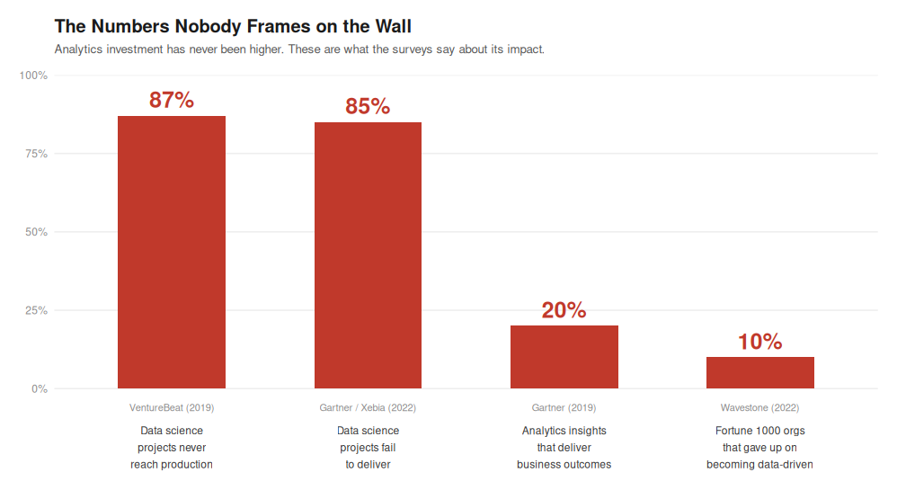
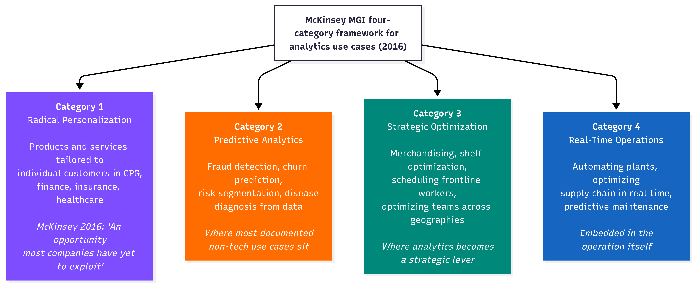
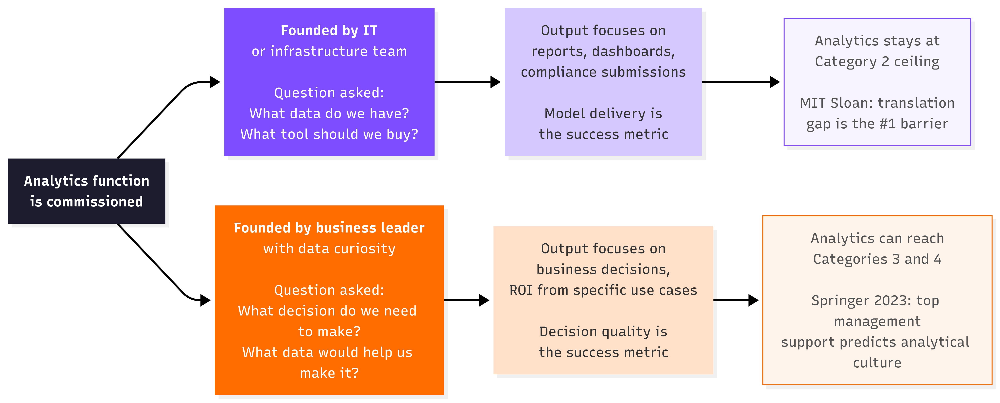
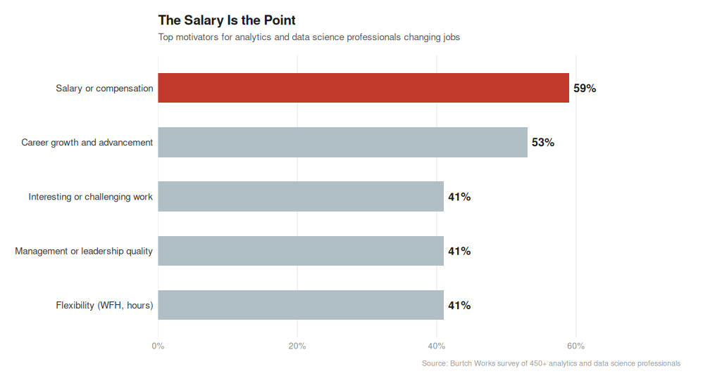
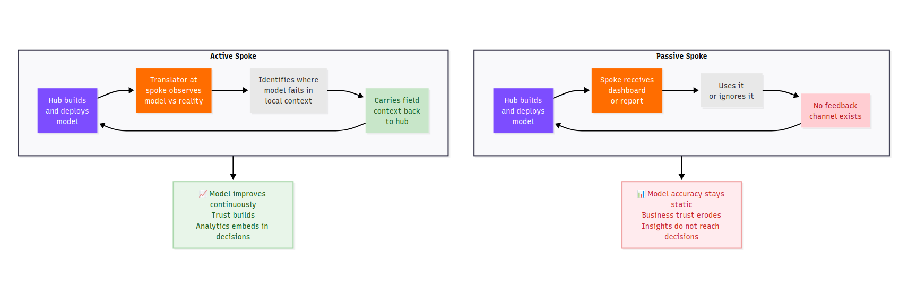

`MIT Sloan` surveyed 2,719 business executives, managers and analytics professionals. The number one barrier to getting value from analytics was not data quality. It was not model accuracy. It was not cloud infrastructure. It was translating analytics into business decisions. One respondent described the challenge as *"developing middle management skills at interpretation."*

> Source: [MIT Sloan Management Review, Minding the Analytics Gap, 2015](https://sloanreview.mit.edu/article/minding-the-analytics-gap/)

Wavestone (formerly NewVantage Partners) has surveyed Fortune 1000 Chief Data Officers every year since 2012. In 2022, their finding was stark. Between 2019 and 2022, nearly **10%** of organizations gave up on becoming data-driven entirely. Over **90%** cited people and process challenges as the greatest barrier. Not technology.

> Source: [Wavestone / NewVantage Partners, Data and AI Leadership Executive Survey, 2022](https://www.businesswire.com/news/home/20220103005036/en/NewVantage-Partners-Releases-2022-Data-And-AI-Executive-Survey)

These are not companies that did not invest. They are companies that did invest, heavily, and still could not move the needle. That is the question this article tries to answer. Not why companies are failing to adopt analytics. They have adopted it. The question is why adoption and impact keep arriving separately.

---



These four numbers come from four independent sources across six years. They are not measuring the same thing. They are measuring the same failure from four different angles. The failure is not technical. It is organizational.

---

## Part One: What Are Analytics Functions Actually Being Asked to Solve?

The `McKinsey Global Institute` published its *Age of Analytics* report in December 2016, based on surveys of more than 600 industry experts. It classified high-value analytics use cases into four categories, ranked by business impact and data readiness.



The `McKinsey` report's own finding in 2016 about Category 1 was: *"most companies have yet to fully exploit"* this opportunity. That was nine years ago. The Wavestone surveys show that as of 2022, the situation had not materially changed for most Fortune 1000 companies.

---

## Part Two: Who Started It, and for What Problem?

The `McKinsey` report named its biggest talent challenge in 2016 as *"attracting and retaining the right talent not only data scientists but business translators who combine data savvy with industry and functional expertise."* Two years later, in 2018, `McKinsey` formally named this person in the `Harvard Business Review`.

> *"Translators play a critical role in bridging the technical expertise of data engineers and data scientists with the operational expertise of marketing, supply chain, manufacturing, risk, and other frontline managers."*

> Source: [McKinsey, Analytics Translator: The New Must-Have Role, HBR 2018](https://www.mckinsey.com/capabilities/quantumblack/our-insights/analytics-translator)

`McKinsey` estimated demand for translators in the `US` alone would reach **two to four million** by 2026. The question is why this person was missing in the first place. The answer is in how the function was started.



A peer-reviewed paper in *Review of Managerial Science* (Springer, 2023), based on a survey of 305 medium and large companies, found something important. Top management support for business analytics was a strong predictor of an analytical culture. An analytical culture predicted data-driven decision making. But here is the part that matters most, centralization of data use increased with analytics investment but was NOT associated with data-driven decision making.

> Source: [Towards data-driven decision making: the role of analytical culture and centralization efforts, Springer / Review of Managerial Science, 2023](https://link.springer.com/article/10.1007/s11846-023-00694-1)

You can centralize analytics perfectly and still not embed it in decisions. The founding condition is what separates the two paths.

---

## Part Three: What Motivates the Person Doing the Work?

`Burtch Works` surveyed more than 450 analytics and data science professionals on what motivates them to change jobs.



> Source: [Burtch Works, What Motivates Analytics Pros and Data Scientists to Change Jobs, 2018](https://burtchworks.com/2018/06/18/survey-results-what-motivates-analytics-pros-data-scientists-to-change-jobs)

**59%** of analytics professionals say salary is the top reason they change jobs. Interesting or challenging work comes third, tied with management quality and flexibility, at **41%**. This does not mean analytics professionals do not care about their work. It means the primary reason most people entered this field was compensation, and the primary reason they stay or leave is compensation.

`McKinsey`'s translator is the opposite of this profile. The translator's defining characteristic is domain knowledge, not technical skill. McKinsey's documented guidance. *"Business operations are the typical translator's mother tongue. Existing business staff often make better translators than new hires because they have an important quality that is hard to teach the knowledge of a business domain."*

> Source: [McKinsey, How to Train Your Analytics Translators, 2019](https://www.mckinsey.com/capabilities/quantumblack/our-insights/how-to-train-your-analytics-translators)

A person who entered data science because of compensation will solve the problem they are given. A person who entered from the business side and learned data will identify the problem that nobody thought to give them. The distinction is not about intelligence. It is about which direction the curiosity runs.

---

## Part Four: The Spoke That Doesn't Talk Back

Most analytics functions are structured around a hub delivering outputs to business units. The IIA (International Institute for Analytics) named the US version of this oscillation the `oscillation trap` in 2025, defined as *"the cycle of flipping between centralized and distributed structures, without ever addressing the deeper issue: the lack of an intentional operating model."*

> Source: [IIA, Federated Analytics Resource Hub, 2025](https://iianalytics.com/federated-analytics)

The organizational model is not the real problem. What matters is whether the spoke is active or passive.



`McKinsey` (2019) documented what the active spoke looks like in practice *"The process concludes with implementation of the analytics solution, which the translator facilitates by helping users incorporate it into their routines. This often includes explaining to end users what takes place inside the 'black box' of a model, so they can be comfortable leveraging the insights it delivers."*

> Source: [McKinsey, How to Train Your Analytics Translators, 2019](https://www.mckinsey.com/capabilities/quantumblack/our-insights/how-to-train-your-analytics-translators)

`HUL`'s Shikhar `eB2B` app is an active spoke. The field sales representative's behavior at the kirana store which product recommendations they follow, which they skip is implicit feedback that refines what the model recommends next time. The model learns from the field. The `VentureBeat` number (87% of data science projects never reach production) and the Gartner number (20% of insights deliver business outcomes) are both describing passive spokes at scale.

---

## Part Five: The India Question — What the Evidence Supports and What It Does Not

The pattern in the use case table is visible. India's documented analytics use cases show a higher incidence of `McKinsey` Category 3. The founding condition evidence supports a structural reason for this. `India`'s `R&D` spend is **0.6%** of `GDP` versus **2.74%** for the `US`.

> Source: [Brookings Institution, Artificial Intelligence and Data Analytics in India, 2022](https://www.brookings.edu/articles/artificial-intelligence-and-data-analytics-in-india/)

At those investment levels, every analytics project has to justify its existence with a named business problem before resources are released. That financial constraint forces the business-problem-first founding condition. Capital scarcity produced the right starting question by accident, not by design.

`IIM` Bangalore introduced a Business Analytics elective in **2008**, the year after Davenport's *Competing on Analytics* was published. `IIM` Ahmedabad's Professor Arindam Banerjee spent 2006–07 building a global risk analytics team at `HSBC` in the `US`, returned to teach at `IIMA`, and then delivered executive education to `LIC`, Indian Oil, Larsen and Toubro and Aviva.

> Source: [IIM Ahmedabad, faculty profile](https://online.iima.ac.in/course/course-v1:IIMA+ODSFC101x+2024_06/)

That is a direct knowledge-transfer vector. India's management education absorbed what US analytics failures looked like before India repeated them. The `IIA`'s oscillation trap (centralized to decentralized to hub-and-spoke) consumed years of US organizational budget. India's capital-constrained non-tech companies did not have the budget to centralize in the first place, so they arrived at a hub-and-spoke equivalent without paying the oscillation cost.

**What the evidence does NOT support:** No peer-reviewed comparative study has systematically measured whether India's non-tech analytics functions are more embedded in business decisions than US equivalents. The structural argument above is supported by pattern from documented cases and indirect evidence from capital constraint and education transfer data. It is a hypothesis with evidence, not a proved finding. This article will not dress it as more than that.

---

## Part Six: What the Strategic Lever Actually Requires

The `Springer` peer-reviewed paper (305 companies, *Review of Managerial Science*, 2023) found two predictors of an analytical culture, and one non-predictor.

**Predictors:** Top management support for business analytics. Perceived data quality.

**Non-predictor:** Centralization of analytics. Centralizing analytics increased data use but was NOT associated with data-driven decision making.

> Source: [Towards data-driven decision making, Springer / Review of Managerial Science, 2023](https://link.springer.com/article/10.1007/s11846-023-00694-1)

This is a peer-reviewed finding that maps directly to what `MIT Sloan` named as the barrier, what `Wavestone` found in 12 years of CDO surveys, and what `McKinsey` named in 2016 before they formalized the translator in 2018. The pattern is consistent across independent sources spanning a decade.

The strategic lever has four ingredients, each backed by independent evidence:

**Ingredient 1:** A business problem as the founding question, not a technology capability as the founding asset. Evidence of the founding condition paths and their documented outcomes.

**Ingredient 2:** Top management as sponsor not spectator. Evidence of `Springer` (2023), which found top management support predicts analytical culture, which predicts data-driven decisions.

**Ingredient 3:** A translator embedded at the spoke, not only at the hub. Evidence of `McKinsey` (2018, 2019), which named this person as the critical missing role and estimated 2 to 4 million were needed in the `US` by 2026.

**Ingredient 4:** Use cases defined by Category 3 and Category 4 problems, not by what data is available. Evidence of `McKinsey MGI` (2016), which identified strategic optimization and real-time operations as the highest-value categories and noted they were the most under-exploited.

None of these ingredients are about model sophistication. None require a larger analytics team. None require more cloud infrastructure. The `Wavestone` 2023 survey found the number one obstacle to analytics value in Fortune 1000 companies was **cultural** and *"difficulty in changing organizational behaviors or attitudes."*

> Source: [Wavestone / NewVantage Partners, Data and AI Leadership Executive Survey, 2023](https://www.prnewswire.com/news-releases/newvantage-partners-a-wavestone-company-releases-2023-data-and-analytics-leadership-executive-survey-301711081.html)

Cultural is not a soft word here. It means the organization has not decided that analytics is central to how decisions get made. It has decided that analytics is a useful support to decisions that get made by other means. Those are two completely different organizations, with the same models, the same tools and the same headcount.

---

## The One Question That Reveals Everything

`MIT Sloan` (2016) wrote that analytics had become *"a mainstream idea but not a mainstream practice."* That was nine years ago.

> Source: [MIT Sloan Management Review, Competing with Data and Analytics, 2016](https://sloanreview.mit.edu/big-ideas/data-analytics/)

The gap between idea and practice is not a technology problem. Every piece of evidence reviewed for this article points to the same place. The problem is organizational. And the organizational problem traces back to one question that most companies never asked when they built their analytics function.

Not: what data do we have?

Not: what tools should we buy?

Not: how many data scientists do we need?

The question is **what decision does the business need to make, and who is going to sit in the room when that decision is made?**

The analytics function that cannot answer that question is a reporting function with a good `LinkedIn` presence. The analytics function that was built around that question is a strategic lever. The evidence shows which one is more common. It also shows what makes the difference.

---

## Key Sources

1. MIT Sloan Management Review. (2015). Minding the Analytics Gap. [Link](https://sloanreview.mit.edu/article/minding-the-analytics-gap/)

2. MIT Sloan Management Review / SAS. (2016). Competing with Data and Analytics (analytics is a mainstream idea, not mainstream practice). [Link](https://sloanreview.mit.edu/big-ideas/data-analytics/)

3. Wavestone / NewVantage Partners. (2022). Data and AI Leadership Executive Survey (90%+ cite people/process; 10% gave up). [Link](https://www.businesswire.com/news/home/20220103005036/en/NewVantage-Partners-Releases-2022-Data-And-AI-Executive-Survey)

4. Wavestone / NewVantage Partners. (2023). Data and AI Leadership Executive Survey (cultural factors remain greatest obstacle). [Link](https://www.prnewswire.com/news-releases/newvantage-partners-a-wavestone-company-releases-2023-data-and-analytics-leadership-executive-survey-301711081.html)

5. McKinsey Global Institute. (December 2016). The Age of Analytics: Competing in a Data-Driven World (four-category framework; business translator gap named). [Link](https://www.mckinsey.com/capabilities/quantumblack/our-insights/the-age-of-analytics-competing-in-a-data-driven-world)

6. McKinsey. (2018). Analytics Translator: The New Must-Have Role (2 to 4 million translators needed in US by 2026). [Link](https://www.mckinsey.com/capabilities/quantumblack/our-insights/analytics-translator)

7. McKinsey. (2019). How to Train Your Analytics Translators. [Link](https://www.mckinsey.com/capabilities/quantumblack/our-insights/how-to-train-your-analytics-translators)

8. McKinsey. (2018). Ten Red Flags Signaling Your Analytics Program Will Fail (data lake without business case case study). [Link](https://www.mckinsey.com/capabilities/quantumblack/our-insights/ten-red-flags-signaling-your-analytics-program-will-fail)

9. Springer / Review of Managerial Science. (2023). Towards data-driven decision making: the role of analytical culture and centralization efforts (305 companies; centralization ≠ data-driven decisions). [Link](https://link.springer.com/article/10.1007/s11846-023-00694-1)

10. IIA — International Institute for Analytics. (2025). Federated Analytics / Oscillation Trap. [Link](https://iianalytics.com/federated-analytics)

11. Burtch Works. (2018). What Motivates Analytics Pros and Data Scientists to Change Jobs (salary 59% top motivator). [Link](https://burtchworks.com/2018/06/18/survey-results-what-motivates-analytics-pros-data-scientists-to-change-jobs)

12. Gartner. (2019). Only 20% of analytics insights will deliver business outcomes. Cited in: Roberts, L. Beyond Data to Value, LinkedIn Pulse, 2023.

13. VentureBeat. (2019). 87% of data science projects never make it to production. Cited in: Info-Tech Research Group. [Link](https://www.infotech.com/research/ss/build-a-reporting-and-analytical-insights-strategy)

14. Xebia. (2022). Analytics Translator in Practice (85% failure rate, citing Gartner). [Link](https://xebia.com/blog/analytics-translator-in-practice-google-translate-analogy/)

15. Brookings Institution. (2022). AI and Data Analytics in India (India R&D 0.6% of GDP vs US 2.74%). [Link](https://www.brookings.edu/articles/artificial-intelligence-and-data-analytics-in-india/)

16. IIM Bangalore. Business Analytics: Science of Data Driven Decision Making (Business Analytics elective introduced 2008). [Link](https://eep.iimb.ac.in/course/business-analytics-science-of-data-driven-decision-making/)

17. IIM Ahmedabad. Faculty Profile — Prof. Arindam Banerjee (HSBC risk analytics 2006–07; executive education to LIC, IOC, L&T, Aviva). [Link](https://online.iima.ac.in/course/course-v1:IIMA+ODSFC101x+2024_06/)

18. Elets News Network. (2019). RBL Bank — Evolving with Technologies for Mitigating Risk. [Link](https://bfsi.eletsonline.com/rbl-bank-evolving-with-technologies-for-mitigating-risk/)

19. Klover.ai. (2025). Hindustan Unilever AI Strategy — Shikhar, field-level analytics. [Link](https://www.klover.ai/hindustan-unilever-ai-strategy-analysis-of-dominance-in-fast-moving-consumer-goods-ai/)

20. Ascent Group India. (2024). Marketing Strategies of NBFCs in Rural India — Bajaj Finserv AI credit scoring. [Link](https://ascentgroupindia.com/blog/strategic-rural-marketing/marketing-strategies-of-nbfcs-in-rural-india/)

21. Analytics India Magazine. Analytics in Indian Banking Sector (ICICI debt collection model). [Link](https://analyticsindiamag.com/analytics-in-indian-banking-sector-on-a-right-track)

22. Databricks. (2024). HDFC Bank: Accelerating Bank Business Processes with Data Efficiency. [Link](https://www.databricks.com/customers/hdfc-bank)

23. Davenport, T. H., and Harris, J. G. (2007). *Competing on Analytics: The New Science of Winning*. Harvard Business School Press.

24. NCSU Institute for Advanced Analytics. About the Institute (founded 2007 with SAS gift; first MSA program). [Link](https://analytics.ncsu.edu/?page_id=2)

```{=html}
<script src="https://giscus.app/client.js"
        data-repo="ArunKoundinya/CanvassAndAnalyze"
        data-repo-id="R_kgDOLTnAQQ"
        data-category="General"
        data-category-id="DIC_kwDOLTnAQc4CdYId"
        data-mapping="pathname"
        data-strict="0"
        data-reactions-enabled="1"
        data-emit-metadata="0"
        data-input-position="bottom"
        data-theme="transparent_dark"
        data-lang="en"
        crossorigin="anonymous"
        async>
</script>
```