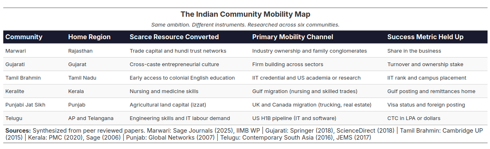
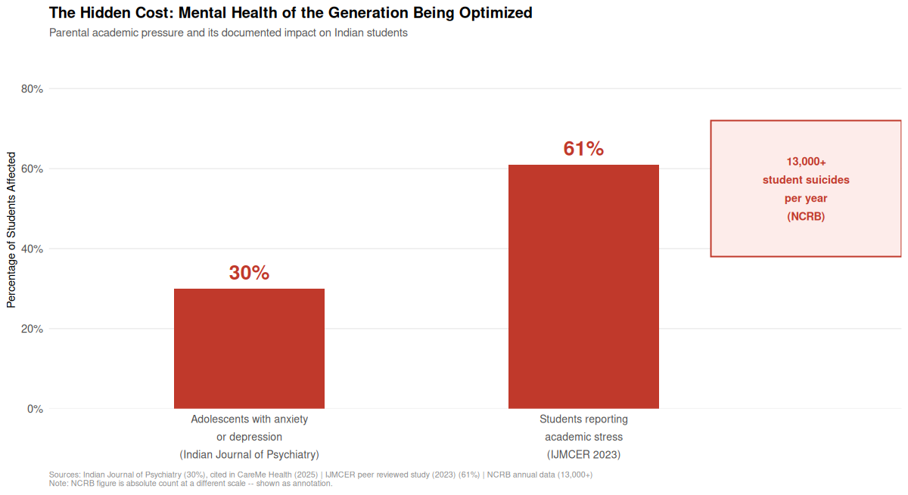
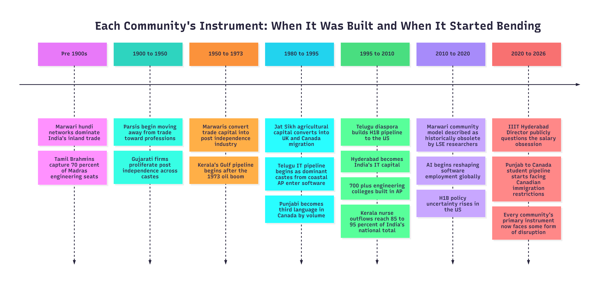

A few weeks ago, someone asked me a pointed question. "Why do Telugu parents only measure their child in `CTC`?" I answered confidently. I said it was specific to the Telugu community and their `IT` pipeline to the United States. I was informed that there is a different question in every community. The Marwari parent asks "how much equity do you own?" The Gujarati parent asks "what is your turnover?" The Tamil Brahmin parent asks "which `IIT`?" The Keralite parent asks "where is your Gulf posting?" The Punjabi Jat Sikh parent asks "have you gone abroad?" Each community has its own instrument and its own question, but the underlying obsession is the same measuring the child's success through a well worked metric that is visible and comparable to the community at large. 

Every major Indian community read the scarce resources available to it, identified the highest leverage pathway, and built an entire generational mythology around that one pathway. Some built it around trade. Some around migration. Some around credentials. Some around land converted to professional capital. The instruments are different. The underlying drive is identical.

The `Bhagavad Gita` in [Chapter 3, Verse 27](https://www.holy-bhagavad-gita.org/chapter/3/verse/27/) says

>prakṛiteḥ kriyamāṇāni guṇaiḥ karmāṇi sarvaśhaḥ\
>ahankāra-vimūḍhātmā kartāham iti manyate

Each community believes its particular pathway to success is the result of its unique culture or intelligence. Let us explore the article with that assumption in mind, in which I will explore two things. First, what each major Indian community actually optimized for, based on the research evidence. Second, what was won and what was quietly lost in this optimization, for the parents and for the people they raised.

---

## PART ONE: THE MOBILITY MAP



### The Marwaris: From Moneylenders to Industrial Owners

If you want to understand how a community converts a single scarce resource into lasting structural power, study the Marwaris.

A peer reviewed article published in *Sage Journals* (2025), titled *"The Marwaris: Tracing the Rise and Growth of the Trading Communities from Marwar"*, documents how merchants from the Marwar region of Rajasthan began as moneylenders and financiers in the Mughal era, built an informal banking system called `hundi` that connected Rajputana to Bengal and Bihar, and by the end of World War One had controlled much of India's inland trade.

> Source: [Sage Journals, 2025](https://journals.sagepub.com/doi/10.1177/03769836251334009)

Post independence, the conversion of trading capital into industrial ownership was decisive. A working paper from `IIMB` found that `44%` of directors and owners in the top Indian firms belong to three communities together: Marwari, Gujarati and Parsi, communities that together represent less than `6%` of India's population.

> Source: [IIMB Working Paper](https://www.iimb.ac.in/sites/default/files/inline-files/mani-forthcoming.pdf)

A peer reviewed paper in `Tactful Management Research Journal` documented the specific mechanism, the Marwari community maintained informal trust networks that allowed capital to move between community members faster and cheaper than any formal banking system could. The Birlas, Bajajs, Mittals, Goenkas, Piramals were not outliers. They were expressions of a community strategy that had been refined over three centuries.

The instrument the Marwari parent held up for their child was never a salary slip. It was ownership. The question was never "what is your `CTC`?". It was "where is your share in the business?"

---

### The Gujaratis: Entrepreneurship as Cultural Operating System

The Gujarati case is different from the Marwari case in one important way. The Marwari mobility story was driven by a specific caste formation. The Gujarati story cut across caste lines more broadly.

A peer reviewed paper published in the *Journal of Global Entrepreneurship Research* (Springer, 2018), titled *"Familial Legacies: A Study on Gujarati Women and Family Entrepreneurship"*, found that Gujaratis across all castes and religious backgrounds, including Hindus, Parsis, Jains and Marwaris domiciled in Gujarat, share a unified entrepreneurial orientation. The paper notes:

> *"The major communities of Gujarat, other than the majority Hindu religion, include the Parsees, Marwaris and Jains. In the rest of India, these religious communities do not necessarily engage in business. Hence, the understanding is that Gujaratis, irrespective of their religious beliefs, become entrepreneurs."*

> Source: [Springer, Journal of Global Entrepreneurship Research, 2018](https://link.springer.com/article/10.1186/s40497-018-0090-x)

A separate ScienceDirect paper titled *"Entrepreneurial Communities and Family Enterprises of India"* documented that Gujaratis of all castes started a host of firms in the post independence period, establishing the community as one of the most broadly entrepreneurially active in India.

> Source: [ScienceDirect](https://www.sciencedirect.com/org/science/article/abs/pii/S1750620418000249)

The instrument the Gujarati parent held up was: build something you own. The success metric was not salary. It was whether the child could run a venture and eventually hand it forward to the next generation. This is why the Gujarati diaspora in the `UK`, East Africa and the `US` built communities around trade and small business ownership, not around IT employment.

---

### The Tamil Brahmins: Meritocracy as Caste Capital

The Tamil Brahmin community engineered perhaps the most sophisticated mobility strategy of any Indian group in the 20th century. They converted the credential, specifically the engineering degree and later the `IIT` brand, into a form of intergenerational caste capital.

A peer reviewed paper published in *Comparative Studies in Society and History* (Cambridge University Press), titled *"Making Merit: The Indian Institutes of Technology and the Social Life of Caste"*, is the definitive academic work on this. The author argues:

> *"The IIT graduate's status depends on the transformation of privilege into merit, or the conversion of caste capital into modern capital."*

> Source: [Cambridge University Press, CSSH](https://www.cambridge.org/core/journals/comparative-studies-in-society-and-history/article/abs/making-merit-the-indian-institutes-of-technology-and-the-social-life-of-caste/C776AC2172B4FF45F87C130C45FA1C1A)

Open Magazine documented the historical root: by the 1920s, Tamil Brahmins had filled over `70%` of seats in regional engineering institutions in the Madras Presidency, despite being barely `3%` of the regional population. When regional reservations threatened this dominance, Tamil Brahmins were among the first to frame merit itself as a caste claim and the `IITs` as their natural institution.

> Source: [Open Magazine](https://openthemagazine.com/essays/open-essay/an-anatomy-of-the-caste-culture-at-iit-madras)

The instrument the Tamil Brahmin parent held up was not the salary but the entrance rank. Which `IIT`? Which branch? Which campus placement? The `CTC` mattered, but it was downstream of the credential. The credential was the identity.

---

### The Keralites: Migration as a Family Strategy for Social Mobility

Kerala built a mobility strategy unlike any other state in India. It did not rely on business capital, engineering credentials or IT employment. It relied on care and skilled labour channeled through a Gulf pipeline that transformed one of India's most densely populated states into one of its most remittance dependent economies.

A peer reviewed paper published in *PMC (NCBI)*, titled *"Revisiting Kerala's Gulf Connection: Half a Century of Emigration, Remittances and Their Macroeconomic Impact, 1972 to 2020"*, documents that the Gulf oil boom of 1973 became a watershed moment for Kerala. Almost half of the four million Indian emigrants to the Gulf are from Kerala alone.

> Source: [PMC, NCBI](https://pmc.ncbi.nlm.nih.gov/articles/PMC7571534/)

The nursing pipeline was specific and deliberate. Research published in the *Journal of Ethnic and Migration Studies* (Sage, 2006), titled *"Indian Nurses in the Gulf: Two Generations of Female Migration"*, found that one generation after the Gulf migration began, thousands of young women, predominantly Christians from Kerala, were filling nursing schools across India with the specific intention of migrating after graduation. The nursing diploma had become what the author described as "a passport opening the world not only to the nurse herself but also to her relatives."

> Source: [Sage Journals, 2006](https://journals.sagepub.com/doi/10.1177/0262728006063198)

Research cited in the same body of literature found that recorded annual nurse outflows from Kerala comprised between `85` and `95` percent of India's total national nurse emigration between 2016 and 2019.

> Source: [Bristol University Press Digital](https://bristoluniversitypressdigital.com/display/book/9781529221510/ch002.xml)

The instrument the Keralite parent held up was a nursing or medicine degree and a foreign posting. The success metric was the Gulf remittance, the house built back home and the eventual sponsorship of the next family member.

---

### The Punjabi Jat Sikhs: Land, Izzat and the Western Migration

The Punjabi Jat Sikh community built its mobility strategy on agricultural capital converted first into western migration and then into real estate, trucking and trade in the `UK` and Canada.

A peer reviewed paper in *Global Networks* (Taylor and Francis), titled *"Migration, Development and Inequality: Eastern Punjabi Transnationalism"*, found that the relative wealth of the Jat Sikh caste group had partly enabled them to mobilise the resources necessary to dominate migration from Punjab to western societies including the `UK`. The paper introduced the concept of `izzat`, the community honour framework:

> *"High izzat, formerly asserted by Jat Sikhs via the ownership and control of agricultural land, but now through western migration, partly enabling caste dominance and social mobility."*

> Source: [Global Networks, Taylor and Francis](https://www.researchgate.net/publication/250934154_Migration_development_and_inequality_Eastern_Punjabi_transnationalism)

Research on Punjab to Canada migration found that as of 2022, `2,26,450` Canadian student visas were approved for Indian students and Punjab students constitute a dominant share. The study found among communities it was the Jat Sikhs who topped the chart of migrant households. According to the 2016 Canadian Census, after English and French, Punjabi is the third most spoken language in Canada with over `7,00,000` speakers.

> Source: [IRJMETS, 2024](https://www.irjmets.com/uploadedfiles/paper//issue_6_june_2024/59237/final/fin_irjmets1718609160.pdf)

The instrument the Punjabi Jat Sikh parent held up was the visa and the foreign posting. The success metric was whether the child had "gone abroad" and was sending money home.

---

### The Telugu Community: The IT Pipeline and the H1B Dream

The Telugu community, specifically dominant caste groups from coastal Andhra like the Kammas and Kapus, built its generational mobility strategy around a very specific pipeline engineering degree, `Hyderabad` IT job, `H1B` visa, `US` settlement.

A peer reviewed paper in *Contemporary South Asia* (Taylor and Francis, 2016) documented what researchers call a distinct regional social imaginary in coastal Andhra:

> *"A pervasive social imaginary emerged in coastal Andhra that directly equates an engineering degree, a software job and migration to the US with economic success and social prestige."*

> Source: [Contemporary South Asia, Taylor and Francis, 2016](https://www.tandfonline.com/doi/abs/10.1080/09584935.2016.1203863)

The scale of infrastructure built around this single channel was extraordinary. The same research documented over `700` engineering colleges in Andhra Pradesh with `3,00,000` seats. A second peer reviewed paper in the *Journal of Ethnic and Migration Studies* (Taylor and Francis, 2017), titled *"Caste, Kinship and the Realisation of the American Dream: High Skilled Telugu Migrants in the USA"*, showed that migration pathways from coastal Andhra to the `US` are sustained through networks of kinship, caste and endogamous transnational marriage alliances.

> Source: [Journal of Ethnic and Migration Studies, Taylor and Francis, 2017](https://www.tandfonline.com/doi/full/10.1080/1369183X.2017.1314598)

The instrument the Telugu parent held up was the `CTC` and the visa status. The question "Ela undi `CTC`?" was not cultural shallowness. It was the community's most visible and comparable measure of whether the pipeline had delivered.

---


When you look at this map, the first thing that should strike you is this that every community was playing the same game. Every parent in every state was doing the same thing. They were identifying the highest leverage, lowest barrier and most visible pathway available to their child and betting everything on that one instrument. The `CTC` question and the visa question and the "how much equity do you own" question are all the same question expressed through different community vocabularies.

So where does the real difference lie?

---

## PART TWO: WHAT WAS WON AND WHAT WAS LOST

### What Was Won: Genuine Social Mobility

It would be dishonest to write an article like this without first acknowledging what these community strategies actually delivered. They delivered something that previous generations of those same families could not have imagined.

Research on caste and social mobility in contemporary India, published in the *International Journal of Social Impact* (2018), found that empirical analysis of social mobility trends reveals persistent disparities across caste lines, with individuals from historically marginalized groups facing significant structural barriers to upward mobility.

> Source: [International Journal of Social Impact, 2018](https://ijsi.in/wp-content/uploads/2024/05/18.02.016.20180304.pdf)

Against that backdrop, the pipelines each community built were not trivial achievements. The Jat Sikh farmer whose son now owns a trucking company in British Columbia, the Keralite Ezhava woman whose nursing degree took her from a village in Thrissur to a hospital in Riyadh, the Kamma family from Guntur whose son holds a green card in San Jose, and the Marwari trader whose family now controls a mid-sized conglomerate: each of these is a documented story of families escaping structural constraints that had held their communities down for generations. Research on Kerala specifically found that spatial mobility through the Gulf pipeline converted into lasting social mobility for multiple community groups, including the historically marginalised Ezhava community.

> Source: [Social Mobility in Kerala, ResearchGate](https://www.researchgate.net/publication/247563586_Social_Mobility_in_Kerala_Modernity_and_Identity_in_Conflict)

The community strategies worked. That is the starting point for an honest conversation about what they also cost.

---

### What Was Lost: The Suppression of the Outlier

Every community strategy, by definition, optimises for one channel and devalues every other channel. This is where the cost begins.

A peer reviewed paper published in *Harvard Business School* on caste and entrepreneurship in India found that the concentration of entrepreneurial capital in historically merchant communities, specifically Vaishya, Jain, Marwari and Gujarati castes, creates structural exclusion for those outside those networks. The ability of the merchant caste to create wealth was found to be "still overwhelming" and the rise of non-merchant castes as a new business elite was described as "extremely rare."

> Source: [Asia Pacific Journal of Business, Korea Science](https://www.koreascience.kr/article/JAKO202116656027830.page)

What this means in practice is the following. The child in a Marwari family who wants to be a musician, the son in a Telugu family who wants to start a company instead of taking an `MNC` job, the daughter in a Gujarati family who wants to pursue research science, the Jat Sikh boy who wants to stay in Punjab and farm differently rather than migrate: each of these people is not just making a personal choice. They are departing from the community's generationally reinforced mobility script. And the community, not just the parents, enforces that script through comparison, marriage eligibility, social standing and the withdrawal of support.

The instrument each community chose became the only instrument. The success metric each community chose became the only metric. And the people who did not fit were not failures. They were simply the ones the community had no vocabulary to celebrate.

---

### What Was Lost: The Mental Health of the Generation Being Optimized

The second cost is now measurable and can no longer be described as anecdotal.

A study published in the `Indian Journal of Psychiatry` found that over `30%` of Indian adolescents suffer from anxiety and depression linked to academic pressure. The `National Crime Records Bureau (NCRB)` reports more than `13,000` student suicides every year in India, with academic stress named as a significant contributing factor.

> Source: [CareMe Health, citing Indian Journal of Psychiatry](https://careme.health/blog/parental-pressure-and-mental-health-the-unspoken-struggle-of-indian-youth)

A peer reviewed study published in the `International Journal of Indian Psychology` (2024) found that when students perceive parental expectations as exceeding their own self expectations, the outcome is emotional vulnerability, academic burnout and alienation from the very parents who are meant to be their support system.

> Source: [IJIP, 2024](https://ijip.in/wp-content/uploads/2024/02/18.01.068.20241201.pdf)

A peer reviewed study in `IJMCER` (2023) found that `61%` of students in the study sample reported academic stress, with parental expectation identified as one of the primary contributing factors.

> Source: [IJMCER, 2023](https://www.ijmcer.com/wp-content/uploads/2023/07/IJMCER_G043072078.pdf)


{fig-align="center" width="850"}

Notice that these numbers cut across all communities. The Marwari child who does not want to enter the family business, the Tamil Brahmin child who cannot clear `JEE`, the Keralite child who does not want to become a nurse, the Punjabi Jat child who does not want to migrate: all of them are paying the same psychological cost of a community template that was designed for economic survival and not for individual flourishing.

---

### What Was Lost: The Communities Themselves Are Now Obsolete Instruments

The third and perhaps most structurally serious cost is that the conditions that made each community strategy rational no longer exist in the same form.

A 2014 essay published by `LSE South Asia` noted that the Marwari business community as historians understood it has become obsolete as a business resource. The maturity of capital and information markets made the informal trust network that powered Marwari commerce redundant. The Parsi community, which had been one of India's most powerful business communities, started moving away from trade and industry as early as 1900 and became primarily a community engaged in the professions and creative fields.

> Source: [LSE South Asia Blog, 2014](https://blogs.lse.ac.uk/southasia/2014/09/08/the-marwari-business-community-is-now-a-part-of-history/)

For the Telugu `IT` pipeline specifically, the disruption is already visible. In early 2026, Prof. S.K. Shukla, Director of `IIIT Hyderabad`, the most prestigious technical institution in the Telugu speaking world, publicly stated:

> *"Every year, headlines showcasing graduates from top engineering institutes landing high salary packages have caused remunerations to become the primary metric by which people measure success. This obsession on high salaries may distort the country's long term prospects."*

> Source: [IIIT Hyderabad, 2026](https://www.iiit.ac.in/salary-obsession-distorts-engineering-education/)

`AI` is reshaping software employment. The `H1B` pathway faces increasing policy uncertainty. The 700 plus engineering colleges in Andhra Pradesh are not producing graduates for a market that increasingly does not need them in the volume it once did. The instrument is breaking while the community mythology around it remains entirely intact.



The question each community now faces is identical even if the surface looks different. When the door that your entire generational strategy was built around starts to close, what do you teach the next child?

---

## Conclusion: The Instrument Was Never the Identity

The Bhagavad Gita in Chapter 2, Verse 47 says

>karmaṇy-evādhikāras te mā phaleṣhu kadāchana\
>mā karma-phala-hetur bhūr mā te saṅgo ’stvakarmaṇi

Every community built its strategy around a particular fruit. The `CTC`. The ownership stake. The `IIT` rank. The Gulf posting. The `UK` visa. The community then told its children that pursuing that fruit was their duty.

But the fruit was never the duty. The duty was to find a path to dignity. The communities found one path and mistook it for the only path.

What parents in every Indian community actually wanted was never the number. It was the security behind the number. The freedom from the fear their own parents lived with. The ability to look at their children and know that they would not have to borrow from a landlord, sell gold for school fees, or leave home because home could not sustain them.

That fear is legitimate. That motivation is honourable. But a legitimate fear does not automatically produce a wise strategy. And a strategy that worked for one generation does not automatically work for the next.

The communities that built these mobility pipelines did something extraordinary. They lifted millions of families out of structural poverty and exclusion through the sheer force of collective aspiration. The question for this generation of parents, in every state and in every community, is whether the same collective intelligence that built these pipelines can now be turned toward building a wider vocabulary.

Instead sit with the child alongside with equal respect for the child's aspirations and understanding that the world they are entering is not the same world their parents entered, can we build a community culture that celebrates multiple pathways to dignity instead of one? Can we build a community culture that celebrates the child who does not fit the template as much as the child who does? Can we build a community culture that understands that the instrument was never the identity?

---

## Key Sources and Further Reading

1. Parashar, A. (2025). The Marwaris: Tracing the Rise and Growth of the Trading Communities from Marwar. *Sage Journals*. [Link](https://journals.sagepub.com/doi/10.1177/03769836251334009)

2. IIMB Working Paper. Who Controls the Indian Economy: The Role of Families and Communities. [Link](https://www.iimb.ac.in/sites/default/files/inline-files/mani-forthcoming.pdf)

3. Springer. (2018). Familial Legacies: A Study on Gujarati Women and Family Entrepreneurship. *Journal of Global Entrepreneurship Research*. [Link](https://link.springer.com/article/10.1186/s40497-018-0090-x)

4. ScienceDirect. (2018). Entrepreneurial Communities and Family Enterprises of India. [Link](https://www.sciencedirect.com/org/science/article/abs/pii/S1750620418000249)

5. Subramanian, A. (2015). Making Merit: The Indian Institutes of Technology and the Social Life of Caste. *Comparative Studies in Society and History*, Cambridge University Press. [Link](https://www.cambridge.org/core/journals/comparative-studies-in-society-and-history/article/abs/making-merit-the-indian-institutes-of-technology-and-the-social-life-of-caste/C776AC2172B4FF45F87C130C45FA1C1A)

6. Open Magazine. (2015). An Anatomy of the Caste Culture at IIT Madras. [Link](https://openthemagazine.com/essays/open-essay/an-anatomy-of-the-caste-culture-at-iit-madras)

7. PMC, NCBI. (2020). Revisiting Kerala's Gulf Connection: Half a Century of Emigration, Remittances and Their Macroeconomic Impact, 1972 to 2020. [Link](https://pmc.ncbi.nlm.nih.gov/articles/PMC7571534/)

8. Percot, M. (2006). Indian Nurses in the Gulf: Two Generations of Female Migration. *Journal of Ethnic and Migration Studies*, Sage. [Link](https://journals.sagepub.com/doi/10.1177/0262728006063198)

9. Bristol University Press Digital. (2022). Gendered Mobility and Nurse Migration from India to the Gulf. [Link](https://bristoluniversitypressdigital.com/display/book/9781529221510/ch002.xml)

10. Taylor, S., Singh, M. and Booth, D. (2007). Migration, Development and Inequality: Eastern Punjabi Transnationalism. *Global Networks*. [Link](https://www.researchgate.net/publication/250934154_Migration_development_and_inequality_Eastern_Punjabi_transnationalism)

11. IRJMETS. (2024). The Great Punjab Migration to Canada. [Link](https://www.irjmets.com/uploadedfiles/paper//issue_6_june_2024/59237/final/fin_irjmets1718609160.pdf)

12. Nambiar, S. (2016). Engineering Equality? Education and Im/mobility in Coastal Andhra Pradesh. *Contemporary South Asia*, 24(3). Taylor and Francis. [Link](https://www.tandfonline.com/doi/abs/10.1080/09584935.2016.1203863)

13. Irudaya Rajan, S. and Varghese, V.J. (2017). Caste, Kinship and the Realisation of the American Dream: High Skilled Telugu Migrants in the USA. *Journal of Ethnic and Migration Studies*. Taylor and Francis. [Link](https://www.tandfonline.com/doi/full/10.1080/1369183X.2017.1314598)

14. Korea Science. (2021). A Study on the Caste of Top 50 Indian Companies Founders. *Asia Pacific Journal of Business*. [Link](https://www.koreascience.kr/article/JAKO202116656027830.page)

15. LSE South Asia Blog. (2014). The Marwari Business Community Is Now a Part of History. [Link](https://blogs.lse.ac.uk/southasia/2014/09/08/the-marwari-business-community-is-now-a-part-of-history/)

16. Prof. S.K. Shukla, Director, IIIT Hyderabad. (2026). Salary Obsession Distorts Engineering Education. [Link](https://www.iiit.ac.in/salary-obsession-distorts-engineering-education/)

17. Indian Journal of Psychiatry and NCRB data, cited in CareMe Health. (2025). [Link](https://careme.health/blog/parental-pressure-and-mental-health-the-unspoken-struggle-of-indian-youth)

18. IJIP. (2024). Perceived Parental Expectations, Academic Self Concept and Academic Burnout. [Link](https://ijip.in/wp-content/uploads/2024/02/18.01.068.20241201.pdf)

19. IJMCER. (2023). Parental Pressure and Academic Stress Among Adolescents. [Link](https://www.ijmcer.com/wp-content/uploads/2023/07/IJMCER_G043072078.pdf)

20. International Journal of Social Impact. (2018). The Dynamics of Caste Identity and Social Mobility in Contemporary India. [Link](https://ijsi.in/wp-content/uploads/2024/05/18.02.016.20180304.pdf)

```{=html}
<script src="https://giscus.app/client.js"
        data-repo="ArunKoundinya/CanvassAndAnalyze"
        data-repo-id="R_kgDOLTnAQQ"
        data-category="General"
        data-category-id="DIC_kwDOLTnAQc4CdYId"
        data-mapping="pathname"
        data-strict="0"
        data-reactions-enabled="1"
        data-emit-metadata="0"
        data-input-position="bottom"
        data-theme="transparent_dark"
        data-lang="en"
        crossorigin="anonymous"
        async>
</script>
```